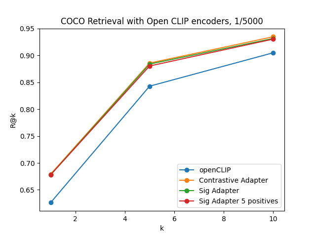
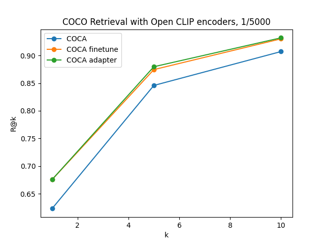

# Contrastive adapter #
Following the [CLIP adapter](https://arxiv.org/abs/2110.04544) approach we train a MLP to adapt the embeddings extracted by the visual and text encoders
of a VLM pretrained in large scale, but instead of learning a classification head we train the MLP using a contrastive 
loss. 

We used two contrastive losses based on [CLIP](https://arxiv.org/abs/2103.00020) and [SigLIP](https://arxiv.org/abs/2303.15343). The adapters were trained with the COCO dataset and evaluated 
on the retrieval task. The encoders used were the [openclip](https://arxiv.org/abs/2212.07143)`s ViT-L.

During image-text evaluation we consider only 1 correct caption in 5000 total captions. The contrastive adapter show comparable performance to the complete fine-tuned COCA model from openclip project.

                                                                                                                                                                                                                                                                                